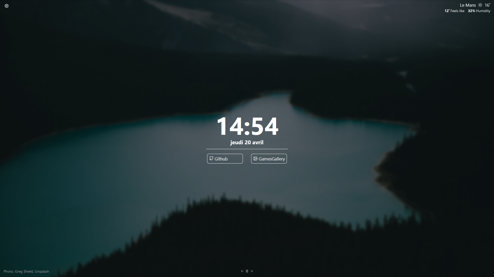

# Tabliss custom theme

---

 

### Github repository of my custom theme of [Tabliss](https://github.com/joelshepherd/tabliss) (navigator's add-on).

 

---

### You can contact me on my website : [alexis-gousseau.com](https://www.alexis-gousseau.com).

