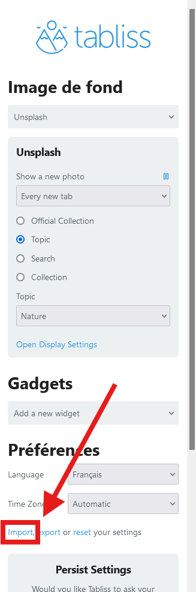

---
layout:
  title:
    visible: true
  description:
    visible: false
  tableOfContents:
    visible: true
  outline:
    visible: true
  pagination:
    visible: true
---

# 📥 Installation

Add the Tabliss extension via the website [https://tabliss.io/](https://tabliss.io/).

Then, download the content of the tabliss.json file in the [Tabliss Custom Theme project](https://github.com/alexis-gss/tabliss-custom-theme) on Github, and import it via the Tabliss extension interface :

<figure><figcaption>
Tabliss Custom Theme - import .json file
</figcaption></figure>

You can now use and customize the Tabliss theme.
